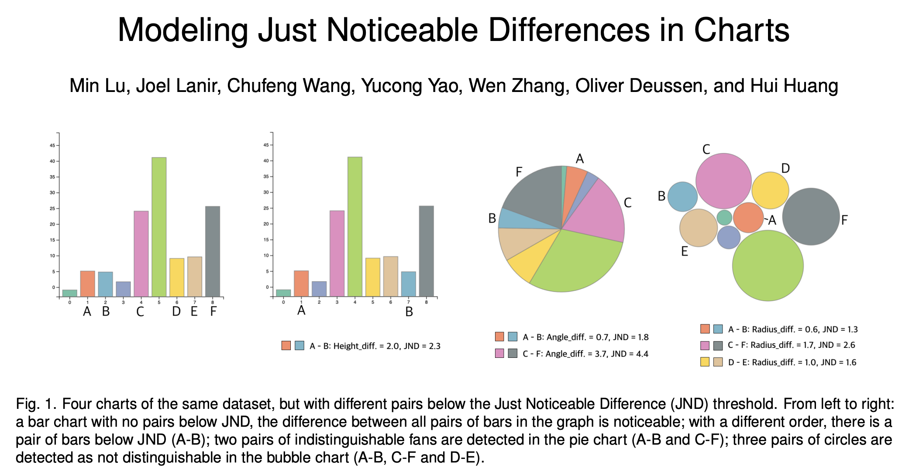

```{r setup, include=FALSE, warning=FALSE, message=FALSE}
options(htmltools.dir.version = FALSE)
library(ggplot2)
library(tidyverse)
library(lme4)
xaringanExtra::use_panelset()
xaringanExtra::use_tile_view()
```

## Outline

- Motivation / Background

- Models for one participant

- One Model for all participants

---

# Just Noticeable Differences?


<span><left>
M. Lu et al., "Modeling Just Noticeable Differences in Charts," in IEEE Transactions on Visualization and Computer Graphics, vol. 28, no. 1, pp. 718-726, Jan. 2022, doi: 10.1109/TVCG.2021.3114874.
</left></span>
---

## Just noticeable differences

Idea goes back to early cognitive findings of the late 1800s and early 1900s

Just noticeable difference is 'smallest change of a stimulus' that is observable (to about 50% of the population). 


Weber-Fechner 'Law': 

> *"Simple differential sensitivity is inversely proportional to the size of the components of the difference; <br>
relative differential sensitivity remains the same regardless of size."*

Weber-Fechner:

$const = \frac{\Delta I}{I}$ independent of intensity $I$ (or at least wide ranges of $I$) 

Applicability under discussion; research in JNDs and what affects it, remains.

---

# A Study

Is B larger than A? 

.pull-left[

```{r echo = FALSE, message=FALSE, warning=FALSE, fig.height=3.5}
dframe <- data.frame(x = factor(1:5), y = c(110, 100, 85, 102, 105))
dframe %>% ggplot(aes( x = x, weight = y)) +
  geom_bar(width=.66) +
  theme_minimal() +
  annotate("text", label="A", size = 12, x = 2, y = 50, colour = "white") +
  annotate("text", label="B", size = 12, x = 4, y = 50, colour = "white")
```
]

.pull-right[

Height of bar A is called intensity $I$

Distance between bars A and B is called $d$

Height of bar B is varied for the experiment.

]

--

```{r echo=FALSE, fig.height= 3.5}
bars <- read.csv("jnd-bar-results.csv")

bars %>% filter(userID=="8_91") %>%
  filter(intensity == 50, distance == 9) %>%
  ggplot(aes(x = X, y = Yes)) + 
  geom_point() +
  theme_bw() +
  xlab("Height of bar B") + 
  ylab("Number of responses: B is taller than A") +
  ggtitle("Participant: 8_91")
```

---

## Participant 8_61


```{r echo=FALSE}
id8_91 <- bars %>% filter(userID=="8_91") %>%
  filter(intensity == 50, distance == 9) %>%
  mutate(`height B` = X)
```


.panelset[
.panel[.panel-name[Data]

```{r}
id8_91 %>% select(`height B`, Total, Yes, distance, intensity)
```

Looks almost too perfect to be true? `r emo::ji("thinking")`

]

.panel[.panel-name[Logistic regression]

```{r highlight.output=c(12, 13)}
logr8_91 <- glm(cbind(Yes, Total-Yes)~`height B`, 
                data = id8_91, family = binomial())
summary(logr8_91)
```  
]

.panel[.panel-name[Predictions]

```{r echo=FALSE, fig.height = 3.5}
pred.frame <- tibble(`height B` = seq(48, 52, by=0.01))
pred.frame$preds <- predict(logr8_91, newdata = pred.frame, type="response")

id8_91 %>%
  ggplot(aes(x = `height B`, y = Yes/Total)) + 
  geom_line(aes(y = preds), data = pred.frame) +
  geom_point(colour = "steelblue", size = 4) +
  theme_bw() +
  xlab("Height of bar B") + 
  ylab("Number of responses: B is taller than A") +
  ggtitle("Participant: 8_91")
```  
]

.panel[.panel-name[PSE]
For  logit $P (Y = y) = aX + b$

'Half way point' $X_{50}$ called **Point of Subjective Equality** (PSE):

$aX_{50} + b = logit (0.50) = 0$

$X_{50} = -b/a$


Here: $X_{50} = - \frac{-480.397}{9.608} = 50.00$


Slope in $X_{50}$: $a/4 = 9.608/4 = 2.402$
]

.panel[.panel-name[JND]
For  logit $P (Y = y) = aX + b$

the Just Noticeable Difference (JND) $\Delta X$  is defined as
the differences in $X$ for prediction values of 0.75 and 0.5:


$\Delta X := X_{75} - X_{50} = \frac{\log(3)}{a}$

For participant 8_61: $\Delta X = \log(3)/9.608 = 0.1143$ (pixels)
]
]


---

## Participant 8_61 (distance 93)


```{r echo=FALSE}
id8_91 <- bars %>% filter(userID=="8_91") %>%
  filter(intensity == 50, distance == 93) %>%
  mutate(`height B` = X)
```


.panelset[
.panel[.panel-name[Data]

```{r}
id8_91 %>% select(`height B`, Total, Yes, distance, intensity)
```

Still pretty perfect.

]

.panel[.panel-name[Logistic regression]

```{r highlight.output=c(12, 13)}
logr8_91 <- glm(cbind(Yes, Total-Yes)~`height B`, 
                data = id8_91, family = binomial())
summary(logr8_91)
```  
]

.panel[.panel-name[Predictions]

```{r echo=FALSE, fig.height = 3.5}
pred.frame <- tibble(`height B` = seq(45, 55, by=0.01))
pred.frame$preds <- predict(logr8_91, newdata = pred.frame, type="response")

id8_91 %>%
  ggplot(aes(x = `height B`, y = Yes/Total)) + 
  geom_line(aes(y = preds), data = pred.frame) +
  geom_point(colour = "steelblue", size = 4) +
  theme_bw() +
  xlab("Height of bar B") + 
  ylab("Number of responses: B is taller than A") +
  ggtitle("Participant: 8_91")
```  
]

.panel[.panel-name[PSE]
For  logit $P (Y = y) = aX + b$

'Half way point' $X_{50}$ called **Point of Subjective Equality** (PSE):

$aX_{50} + b = logit (0.50) = 0$

$X_{50} = -b/a$


Here: $X_{50} = - \frac{-93.166}{1.867} = 49.90$

Slope in $X_{50}$: $a/4 = 1.867/4 = 0.46675$ 
]

.panel[.panel-name[JND]
For  logit $P (Y = y) = aX + b$

the Just Noticeable Difference (JND) $\Delta X$  is defined as
the differences in $X$ for prediction values of 0.75 and 0.5:


$\Delta X := X_{75} - X_{50} = \frac{\log(3)}{a}$

For participant 8_61: $\Delta X = \log(3)/1.867277 = 0.5883$ (pixels)
]
]


---

## Participant 8_61 (all distances)


```{r echo=FALSE}
id8_91 <- bars %>% filter(userID=="8_91") %>%
  filter(intensity == 50) %>%
  mutate(`height B` = X)
```


.panelset[
.panel[.panel-name[Data]

```{r echo = TRUE}
id8_91 %>% group_by(distance) %>% summarize(`Number of responses` = sum(Total))
```

All distances now for participant 8_61 at this intensity.
]

.panel[.panel-name[Distance as Factor]
```{r highlight.output=c(12, 13)}
logr8_91_dfactor <- glm(cbind(Yes, Total-Yes) ~ 
  factor(distance)-1 + `height B`:factor(distance), 
  data = id8_91, family = binomial())
```  

```{r echo=FALSE, fig.height = 3.5}
pred.frame <- tibble(expand.grid(`height B` = seq(40, 60, by=0.01), distance = c(9,  93, 177, 261, 345)))
pred.frame$preds_factor <- predict(logr8_91_dfactor, newdata = pred.frame, type="response")

id8_91 %>%
  ggplot(aes(x = `height B`, y = Yes/Total)) + 
  geom_line(aes(y = preds_factor, group = distance, 
                colour = factor(distance)), data = pred.frame) +
  geom_point(aes(colour = factor(distance)), size = 4) +
  scale_colour_brewer("Distance", palette = "Paired") +
  theme_bw() +
  xlab("Height of bar B") + 
  ylab("Number of responses: B is taller than A") +
  ggtitle("Participant: 8_91")
```  

]

.panel[.panel-name[Look at Estimates]

10 parameters: intercept and slope for each distance level

```{r echo=FALSE}
dt <- broom::tidy(logr8_91_dfactor) %>% 
  mutate(
    distance = parse_number(term),
    type = rep(c("main", "interaction"), each=5)
  )
dtw <- data.frame(
  main=dt$estimate[dt$type=="main"],
  interaction=dt$estimate[dt$type=="interaction"], 
  distance = unique(dt$distance))
dtw <- dtw %>% mutate(
  pse = -main/interaction,
  slope_50 = interaction/4
)
dtlong <- dtw %>% dplyr::select(distance, pse, slope_50) %>%
  pivot_longer(-distance, names_to="term", values_to = "estimate")
```

```{r, echo=FALSE, fig.height = 3.5}
dtlong %>% ggplot(aes(x = distance, y = estimate)) +
  geom_point() +
  theme_bw() +
  facet_wrap(~term, scales="free_y")
```
]

.panel[.panel-name[Reparameterize]

```{r}
logr8_91_dfactor2 <- glm(cbind(Yes, Total-Yes) ~ 
  - 1 + I(`height B`-intensity):factor(distance) , 
  data = id8_91, family = binomial())

```

```{r echo=FALSE, fig.height = 3.5}
pred.frame <- tibble(expand.grid(`height B` = seq(40, 60, by=0.01), distance = c(9,  93, 177, 261, 345), intensity = 50),)
pred.frame$preds_factor2 <- predict(logr8_91_dfactor2, newdata = pred.frame, type="response")

id8_91 %>%
  ggplot(aes(x = `height B`, y = Yes/Total)) + 
  geom_line(aes(y = preds_factor2, group = distance, 
                colour = factor(distance)), data = pred.frame) +
  geom_point(aes(colour = factor(distance)), size = 4) +
  scale_colour_brewer("Distance", palette = "Paired") +
  theme_bw() +
  xlab("Height of bar B") + 
  ylab("Number of responses: B is taller than A") +
  ggtitle("Participant: 8_91")
```  
]

.panel[.panel-name[Model comparison]

```{r}
anova(logr8_91_dfactor2, logr8_91_dfactor)
```
]

]

---

## Participant 8_61 (all distances, intensity = 50)
 
.panelset[

.panel[.panel-name[Distance as factor]

5 parameters: slope for each distance level

```{r echo=FALSE}
dt <- broom::tidy(logr8_91_dfactor2) %>% 
  mutate(
    distance = c(9,93,177,216,345)
  )
```

```{r, echo=FALSE, fig.height = 3.5}
dt %>% ggplot(aes(x = distance, y = estimate/4)) +
  geom_point() +
  theme_bw() 
```

]

.panel[.panel-name[Distance as numeric]
```{r echo=FALSE}
id8_91 <- id8_91 %>% mutate(
  signal = X-intensity
)
```
```{r}
logr8_91_dnum <- glm(
  cbind(Yes, Total-Yes) ~ -1 + signal + signal:log(distance), 
  data = id8_91, family = binomial())
```  

```{r eval=FALSE}
Coefficients:
                     Estimate Std. Error z value Pr(>|z|)    
signal                 6.6533     1.1770   5.653 1.58e-08 ***
signal:log(distance)  -1.0616     0.2062  -5.147 2.65e-07 ***
---
Signif. codes:  0 ‘***’ 0.001 ‘**’ 0.01 ‘*’ 0.05 ‘.’ 0.1 ‘ ’ 1
```
]

.panel[.panel-name[Model comparison]

```{r}
anova(logr8_91_dnum, logr8_91_dfactor2)
```
]

.panel[.panel-name[Predictions]

```{r echo=FALSE, fig.height = 3.5}
pred.frame <- tibble(expand.grid(signal = seq(-10, 10, by=0.01), distance = c(9,  93, 177, 261, 345), intensity = 50),)
pred.frame$preds_num <- predict(logr8_91_dnum, newdata = pred.frame, type="response")

id8_91 %>%
  ggplot(aes(x = signal, y = Yes/Total)) + 
  geom_line(aes(y = preds_num, group = distance, 
                colour = factor(distance)), data = pred.frame) +
  geom_point(aes(colour = factor(distance)), size = 4) +
  scale_colour_brewer("Distance", palette = "Paired") +
  theme_bw() +
  xlab("Height of bar B - bar A") + 
  ylab("Number of responses: B is taller than A") +
  ggtitle("Participant: 8_91")
```  

Half-way point fixed to be at 0.

Difference in height between B and A is spotted easier if bars are closer together.
]

]

---

## Still Participant 8_91 ... now all distances and intensities

.panelset[

.panel[.panel-name[Data]

```{r echo=FALSE}
id8_91 <- bars %>% filter(userID=="8_91") %>%
  mutate(
    signal = X-intensity
)
```

```{r echo=FALSE, fig.height=4, fig.width = 10}
id8_91 %>% 
  ggplot(aes(x = signal, y = Yes/Total, colour = factor(intensity))) +
  geom_point() + facet_grid(.~distance, labeller="label_both") +
  theme_bw() + scale_color_brewer() +
  theme(legend.position="bottom")
```
Intensity (height of bar A) does not seem to have a strong effect on height assessment of B.
]

.panel[.panel-name[Model]
```{r}
logr8_91_dnum_inum <- glm(
  cbind(Yes, Total-Yes) ~ -1 + signal + signal:log(distance) + log(intensity):signal +
     log(intensity):log(distance):signal, 
  data = id8_91, family = binomial())

```

```{r echo=FALSE, fig.height=4, fig.width = 10}
pred.frame <- tibble(expand.grid(
  signal = seq(-10, 10, by=0.01), distance = c(9,  93, 177, 261, 345), intensity = c(50, 100, 150, 200, 250)))
pred.frame$preds_di <- predict(logr8_91_dnum_inum, newdata = pred.frame, type="response")


id8_91 %>% 
  ggplot(aes(x = signal, y = Yes/Total, colour = factor(intensity))) +
  geom_line(aes(y = preds_di), data = pred.frame) + 
  geom_point() + facet_grid(.~distance) +
  theme_bw() + scale_color_brewer() +
  theme(legend.position="bottom")
```
]

.panel[.panel-name[Estimates]
```{r eval=FALSE}
Coefficients:
                              Estimate Std. Error z value Pr(>|z|)    
signal                        5.615247   0.530489  10.585   <2e-16 ***
signal:log(distance)         -0.893241   0.079424 -11.246   <2e-16 ***
signal:log(intensity)         0.016951   0.057168   0.297    0.767    
log(distance):log(intensity) -0.001084   0.002927  -0.370    0.711    
---
Signif. codes:  0 ‘***’ 0.001 ‘**’ 0.01 ‘*’ 0.05 ‘.’ 0.1 ‘ ’ 1
```

... what do we do about the other 27 participants of the study?
]
]

---

## Another two Participants

.panelset[

.panel[.panel-name[Data for 80_74]

```{r echo=FALSE}
id80_74 <- bars %>% filter(userID=="80_74") %>%
  mutate(
    signal = X-intensity
)
```

```{r echo=FALSE, fig.height=4, fig.width = 10}
id80_74 %>% 
  ggplot(aes(x = signal, y = Yes/Total, colour = factor(intensity))) +
  geom_point() + facet_grid(.~distance, labeller="label_both") +
  theme_bw() + scale_color_brewer() +
  theme(legend.position="bottom")
```
This participant is quite a bit worse in the assessment of the height of B.
]

.panel[.panel-name[Model]
```{r}
logr80_74_dnum_inum <- glm(
  cbind(Yes, Total-Yes) ~ -1 + signal + signal:log(distance) + log(intensity):signal +
     log(intensity):log(distance), 
  data = id80_74, family = binomial())

```

```{r echo=FALSE, fig.height=4, fig.width = 10}
pred.frame <- tibble(expand.grid(
  signal = seq(-10, 10, by=0.01), distance = c(9,  93, 177, 261, 345), intensity = c(50, 100, 150, 200, 250)))
pred.frame$preds_di <- predict(logr80_74_dnum_inum, newdata = pred.frame, type="response")


id80_74 %>% 
  ggplot(aes(x = signal, y = Yes/Total, colour = factor(intensity))) +
  geom_line(aes(y = preds_di), data = pred.frame) + 
  geom_point() + facet_grid(.~distance) +
  theme_bw() + scale_color_brewer() +
  theme(legend.position="bottom")
```
]

.panel[.panel-name[Participant 97_60]
```{r echo=FALSE}
id97_60 <- bars %>% filter(userID=="97_60") %>%
  mutate(
    signal = X-intensity
)

logr97_60_dnum_inum <- glm(
  cbind(Yes, Total-Yes) ~ -1 + signal + signal:log(distance) + log(intensity):signal +
     log(intensity):log(distance):signal, 
  data = id97_60, family = binomial())

```

```{r echo=FALSE, fig.height=4, fig.width = 10}
pred.frame <- tibble(expand.grid(
  signal = seq(-10, 10, by=0.01), distance = c(9,  93, 177, 261, 345), intensity = c(50, 100, 150, 200, 250)))
pred.frame$preds_di <- predict(logr97_60_dnum_inum, newdata = pred.frame, type="response")


id97_60 %>% 
  ggplot(aes(x = signal, y = Yes/Total, colour = factor(intensity))) +
  geom_line(aes(y = preds_di), data = pred.frame) + 
  geom_point() + facet_grid(.~distance) +
  theme_bw() + scale_color_brewer() +
  theme(legend.position="bottom")
```

Generally, distance and intensity seem to have the similar relationships with the difference in height between rectangle B and A for the participants. 
]

]

---

# Logistic regression with random effects

**Idea:** allow each participant to have their own slope of detection and their own PSE

We will assume that these participant based values are normally distributed around the population mean (for PSE the population mean is set to 0).

These random effects can be fitted in R using the function `glmer` of the package `lme4`

```{r echo = FALSE}
bars <- bars %>% mutate(signal = signal_pixel)
```

```{r}
library(lme4)

logDI <- glmer(
  cbind(Yes, Total-Yes) ~ -1 + signal + signal:log(distance) + 
    log(intensity):signal +
   #  log(intensity):log(distance):signal +
    (1 + signal| userID), 
  data = bars, family = binomial())

```

---
```{r echo=FALSE}
summary(logDI)
```

---

# Population estimates


JND depends on intensity (height of bar A) and distance between the bars:

```{r}
jnd <- function(model, distance, intensity) {
  log(3)/sum(fixef(model)*c(1,log(distance), log(intensity)))
}

jnd(logDI, 9, 50) 
```

Population based PSE is set to 0

```{r echo=FALSE, fig.width=10, fig.height = 4}
pred.frame <- tibble(expand.grid(
  signal = seq(-10, 10, by=0.01), distance = c(9,  93, 177, 261, 345), intensity = 100, userID="population"))
pred.frame$preds <- predict(logDI, newdata = pred.frame, allow.new.levels=TRUE, type="response")

bars$preds <- predict(logDI, newdata = bars, allow.new.levels=TRUE, type="response")


bars %>% filter(intensity == 100) %>%
  ggplot(aes(x = signal, y = Yes/Total, colour = factor(intensity))) +
#  geom_line(aes(y = preds, group = userID), size = .25, alpha =0.5) + 
  geom_line(aes(y = preds), data = pred.frame, size = 1) + 
  facet_grid(.~distance) +
  theme_bw() + scale_color_manual(values="steelblue") +
  theme(legend.position="bottom")
```


---

# Participants' values

```{r echo=FALSE, fig.width=10, fig.height = 4}
bars %>% filter(intensity == 100) %>%
  ggplot(aes(x = signal, y = Yes/Total, colour = factor(intensity))) +
  geom_line(aes(y = preds, group = userID), size = .25, alpha =0.5) + 
  geom_line(aes(y = preds), data = pred.frame, size = 1) + 
  facet_grid(.~distance) +
  theme_bw() + scale_color_manual(values="steelblue") +
  theme(legend.position="bottom")
```

```{r}
head(ranef(logDI)$userID)
```

---

# Summary

Overall population model tells us, that perception of differences between bars is influenced mostly by how far apart these bars are, and a bit how tall the bars are.

Makes a good case for ordering of bars by height in a barchart (as long as the variable is not ordinal).

Random effect models allow us 

- to think of a participant as a random draw from a population. Think about implications for generalizing the model! 

- to draw strength (more samples) across participants (intensity became significant).

- to assess a participants' skill levels (subject-specific JNDs) and get an idea for the range of skills.

